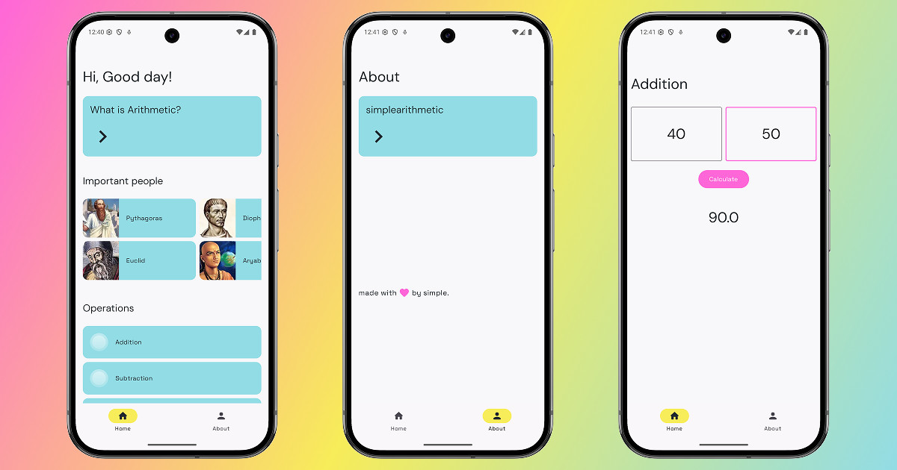

# simplearithmetic


simplearithmetic is an Android app designed to perform basic mathematical operations. Built with Jetpack Compose and Material 3.

:rocket: Part of __*[simplesoftware](https://erad.dev/simplesoftware.html)*__ by __*[erad.dev](https://erad.dev/)*__

## :eyes: Features

- Addition, subtraction, multiplication, and division
- Exponential and square root operations
- Modulus operation
- Modern UI with Material 3
- Bottom navigation for easy navigation
- Optimized performance using MVVM

## :hammer: Tech Stack

- Kotlin
- Jetpack Compose
- Material 3
- MVVM
- Navigation component

## :running: Installation

1. Clone the repository
```
git clone https://github.com/erad-dev-mx/simplearithmetic.git
```
2. Open the project in Android Studio
3. Sync dependencies and run the app on an emulator or device

## :camera: Screenshots



## :sunglasses: Contributing

Contributions are welcome! Feel free to fork the project and submit a pull request.

## :scroll: License
This project is under the MIT license.

with :heart: erick

